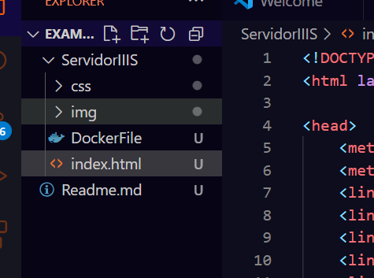
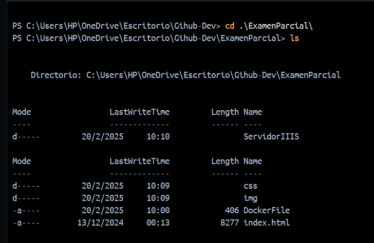
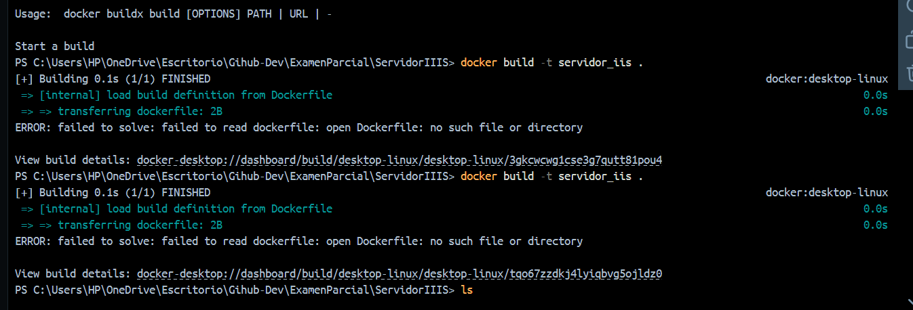

*Estudiante :* Juan Jose Tito Escobar 

*Materia:* Redes 2

Pimer parcial 

# Crear un servidor en docker para IIS

Este manual contienen los pasos para instalaar y crear un servidor para IIS en docker.

Un poco de concepto de lo que es IIS

## Que es IIS

IIS (Internet Information Services) es un servidor web desarrollado por Microsoft que permite alojar y administrar sitios web en sistemas operativos Windows. 

- Características

Es compatible con HTTP, HTTP/2, HTTP/3, HTTPS, FTP, FTPS, SMTP y NNTP. 
Es extensible y modular. 
Tiene una arquitectura de procesamiento de solicitudes que incluye el Servicio de activación de procesos de Windows (WAS). 
Tiene un motor de servidor web que se puede personalizar. 
Tiene una interfaz gráfica de usuario (GUI) llamada Administrador de IIS. 

- Ventajas

Es escalable y puede manejar grandes volúmenes de tráfico.
Tiene características de seguridad para proteger los sitios web y las aplicaciones.
Es compatible con ASP.NET, el framework de desarrollo web de Microsoft.

## Instalación 
### Paso 1: Preparacion del entorno

Abrir Visual Studio y crear los siguientes archivos.
- DockerFile (Aqui pondremos los codigos para crear un servidor)
- Index.html (aqui debe de estar la pagina).




## Paso 2: Ir a archivo de Dockerfile y agrega lo siguiente:

```bash
# Usar la imagen base de Windows Server Core con IIS
FROM mcr.microsoft.com/windows/servercore/iis

# Exponer el puerto 80 para el servidor web
EXPOSE 80

# Copiar los archivos de la página web a la carpeta wwwroot de IIS
COPY ./index.html C:/inetpub/wwwroot/index.html

# Mantener IIS en ejecución
CMD ["powershell.exe", "Start-Service", "W3SVC", "-Verbose", "&&", "ping", "-t", "localhost"]
```
## Paso 3: Contruimos la imagen en el docker 
- Nos dirigimos a la carpeta donde esta nuestro archivo DockerFile y nuestro index.hml



Ahi ingresamos el siguiente comando 
```bash
docker build -t servidor_iis .
```

y nos sale error 
